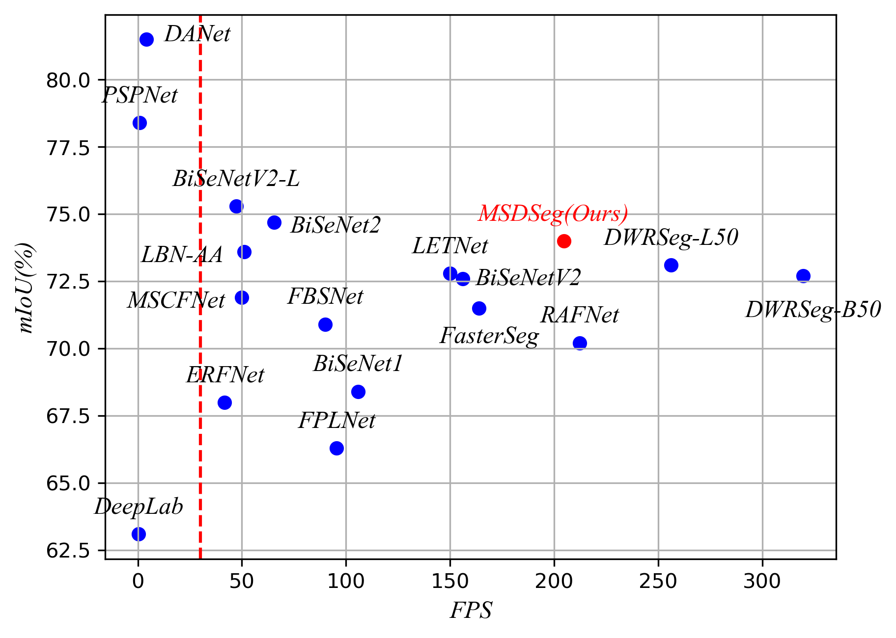

# MSDSeg

#### The official implementation of "MSDSeg: A Lightweight Real-Time Semantic Segmentation Network with MultiScale Dilated Convolution"

MSDSeg


Comparison of MSDSeg with some state-of-the-art methods on the Cityscapes test dataset.




### Setup
Install the dependencies in requirements.txt by using pip and [virtualenv](
https://packaging.python.org/guides/installing-using-pip-and-virtual-environments/).

### Download Cityscapes
go to https://www.cityscapes-dataset.com, create an account, and download
gtFine_trainvaltest.zip and leftImg8bit_trainvaltest.zip.
Unzip both of them and put them in a directory called cityscapes_dataset.
The cityscapes_dataset directory should be inside the RegSeg directory.
If you put the dataset somewhere else, you can set the config field
```
config["dataset_dir"]="the location of your dataset"
```
You can delete the test images to save some space if you don't want to submit to the competition.
Make sure that you have downloaded the required python packages and run
```
CITYSCAPES_DATASET=cityscapes_dataset csCreateTrainIdLabelImgs
```
There are 19 classes.


### Usage
To visualize your model, go to show_cityscapes.py.

To see the model definitions and do some speed tests, go to MSDSeg.py.

To train, validate, benchmark, and save the results of your model, go to train.py.
